Excel-11

Project Description

Excel-11 is a guide to statistical functions in Microsoft Excel. Here you'll find practical tips, instructions, and illustrations about working with functions like AVERAGE, MEDIAN, MODE, STDEV, RAND, RANK, FORECAST, Weighted Average, Moving Average, Percentiles and Quartiles, Box and Whisker Plot and much more.

Table of Contents

AVERAGE 

To calculate the average of a group of numbers, use the AVERAGE function.

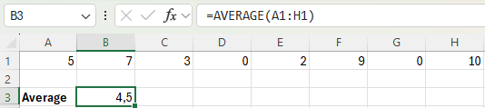

AVERAGEIF

To average cells based on one criteria, use the AVERAGEIF function. For example, to calculate the average excluding zeros.

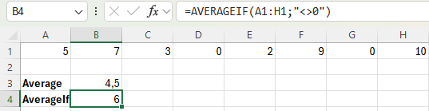

(Note: use AVERAGEIFS to return the average of all cells that meet multiple criteria.)

MEDIAN

To find the median (or middle number), use the MEDIAN function.

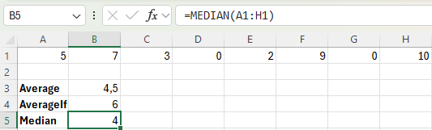

Explanation: in this example we have an even number of digits, so the median will be the arithmetic mean of the 2 middle numbers: 3 and 5.

MODE

To find the most frequently occurring number, use the MODE function.

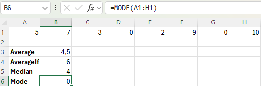

Standard Deviation STDEV

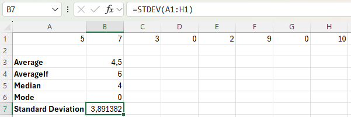

(Note: standard deviation is a number that tells you how far numbers are from their mean.)
(Note: The STDEV function is an old function. Microsoft Excel recommends using the new STDEV.S function which produces the exact same result.)

STDEV.P

The STDEV.P function (the P stands for Population) in Excel calculates the standard deviation based on the entire population.

STDEV.S

The STDEV.S function (the S stands for Sample) in Excel estimates the standard deviation based on a sample.

Variance VAR.P

Variance is the square of the standard deviation.

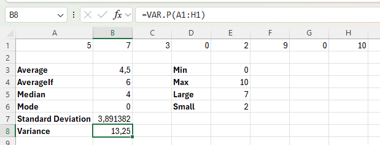

We already know MIN MAX LARGE AND SMALL functions. 

AVERAGEA

The AVERAGEA function also returns the average (arithmetic mean) of a group of numbers. However, the logical value FALSE and cells that contain text evaluate to 0 and the logical value TRUE evaluates to 1. The AVERAGEA function also ignores empty cells.

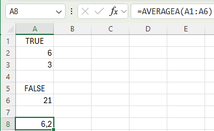

Some examples of AVERAGE function

Use AVERAGE and LARGE in Excel to calculate the average of the top 3 numbers in a data set.

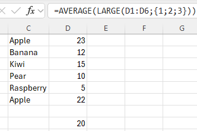

To calculate the average of cells that meet one criteria, use the AVERAGEIF function in Excel.

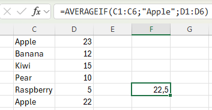

Weighted Average

To calculate a weighted average in Excel, use SUMPRODUCT and SUM.

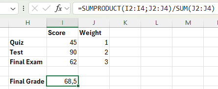

Moving Average

Use the Analysis Toolpak to calculate the moving average of a time series in Excel.

(Note: a moving average is used to smooth out irregularities (peaks and valleys) to easily recognize trends.)

1. On the Data tab, in the Analysis group, click Data Analysis.

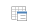

2. Select Moving Average and click OK.

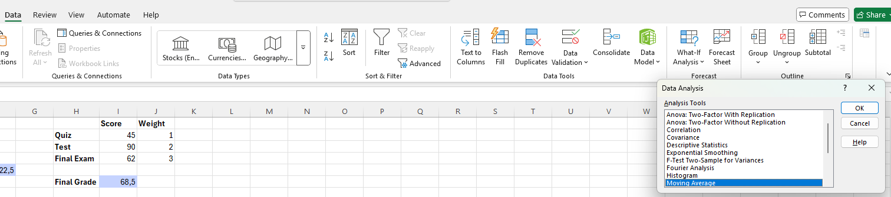

3. Click in the Input Range box and select the range.

4. Click in the Interval box and type 6.

5. Click in the Output Range box and select output cell.

6. Click OK.

7. Repeat steps for interval = 2 and interval = 4.

8. Plot a graph of these values.

Result:

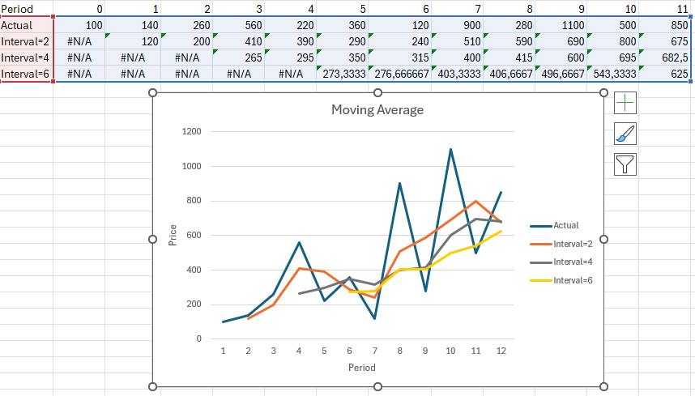

Because we set the interval to 6, the moving average is the average of the previous 5 data points and the current data point. As a result, peaks and valleys are smoothed out. 
The graph shows an increasing trend. Excel cannot calculate the moving average for the first 5 data points because there are not enough previous data points.
Conclusion: The larger the interval, the more the peaks and valleys are smoothed out. The smaller the interval, the closer the moving averages are to the actual data points.

Explanation how to add Analysis ToolPak:

1. On the File tab, click Options.
2. Under Add-ins, select Analysis ToolPak and click on the Go button.
3. Check Analysis ToolPak and click on OK.
4. On the Data tab, in the Analysis group, you can now click on Data Analysis.

RAND

Excel has two very useful functions when it comes to generating random numbers. RAND and RANDBETWEEN.

The RAND function generates a random decimal number between 0 and 1.

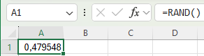

RANDBETWEEN

The RANDBETWEEN function generates a random whole number between two boundaries.

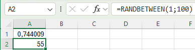

RANDARRAY

If you have Excel 365 or Excel 2021, you can use the RANDARRAY function.

By default, the RANDARRAY function generates random decimal numbers between 0 and 1. The array below consists of 5 rows and 2 columns. You can add boundaries if you need.

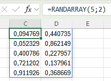

(Note: this dynamic array function, fills multiple cells. This behavior in Excel 365/2021 is called spilling.)
(Note: Random numbers change each time the sheet is recalculated)

RANK and RANK.AVG

The RANK function in Excel returns the rank of a number in a list of numbers. Use RANK.AVG to return the average rank if more than one number has the same rank.

(Note: the RANK function is an old function. Microsoft Excel recommends using the new RANK.EQ function in Excel 2010 or later. There's no difference at all between these two functions.)

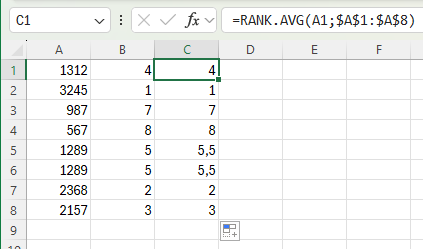

The RANK.AVG function in Excel 2010 or later returns the average rank if more than one number has the same rank.

Cool example

If you're using Excel 365 or Excel 2021, create the following RANK formula.

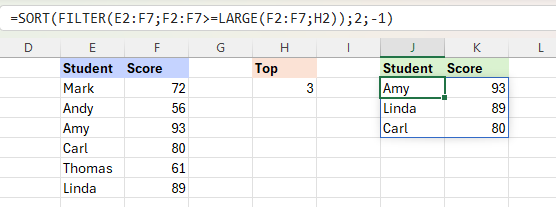

Explanation: We want to show the top 3 results. Enter the value 3 into cell H2. To find the third largest score, use the LARGE function. The FILTER function shows all students with a score greater than or equal to the third largest score. 
Finally, add the SORT function to sort by the second column (second argument), in descending order (third argument).

(Note: The FILTER function, fills multiple cells.)

This RANK formula works for every N. For example, enter the value 5 into cell H2 to show the top 5 results.

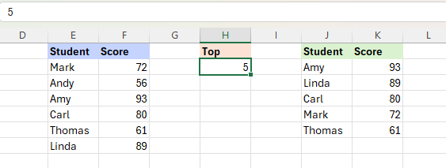

Percentiles and Quartiles

Use the PERCENTILE function shown below to calculate the 30th percentile. Excel returns the value 20,2. This means that 30% (6 out of 20) of the scores are lower or equal to 20,2.

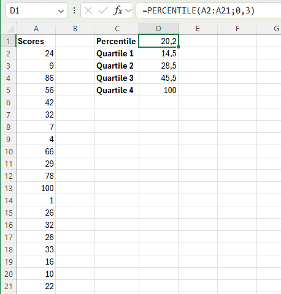

Use the QUARTILE function shown below to calculate the 1st quartile. Excel returns the value 14,5. This means that 25% (5 out of 20) of the scores are lower or equal to 14,5

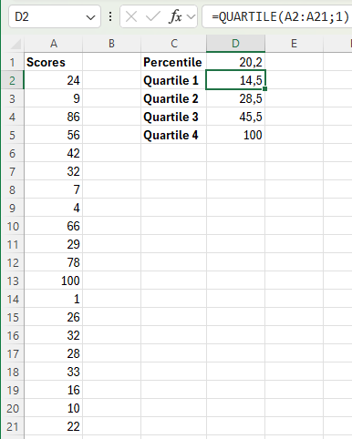

Box and Whisker Plot

A box and whisker plot shows the minimum value, first quartile, median, third quartile and maximum value of a data set.

To create a simple box and whisker plot, execute the following steps.

1. Select the range A1:A7.
2. On the Insert tab, in the Charts group, click the Statistic Chart symbol.
3. Click Box and Whisker.
4. Result:

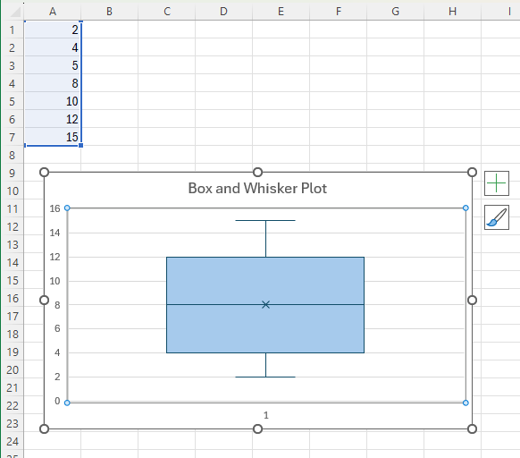

Explanation: the middle line of the box represents the median or middle number (8). The x in the box represents the mean (also 8 in this example). The median divides the data set into a bottom half {2, 4, 5} and a top half {10, 12, 15}. 
The bottom line of the box represents the median of the bottom half or 1st quartile (4). The top line of the box represents the median of the top half or 3rd quartile (12). 
The whiskers (vertical lines) extend from the ends of the box to the minimum value (2) and maximum value (15).

FORECAST & FORECAST.LINEAR

The FORECAST function is an old function. Microsoft Excel recommends using the new FORECAST.LINEAR function which produces the exact same result.

The FORECAST.LINEAR function below predicts a future value along a linear trend.

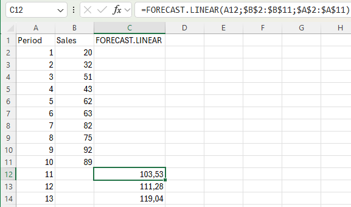

Enter the value 89 into cell C11, select the range A1:C14 and insert a scatter plot with straight lines and markers.

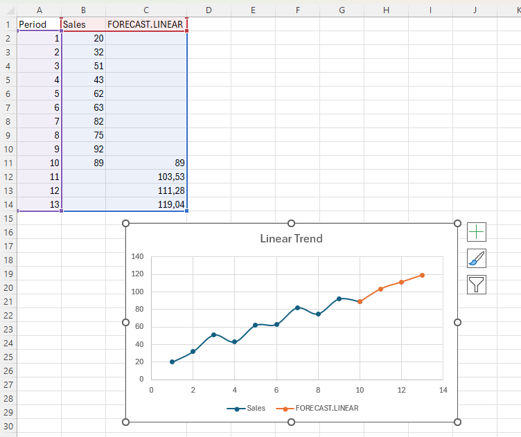

(Note: The FORECAST.ETS function in Excel 2016 or later is a great function which can detect a seasonal pattern.)

MAXIFS and MINIFS

Use MAXIFS and MINIFS in Excel 2016 or later to find the maximum and minimum value based on one criteria or multiple criteria.

FREQUENCY

The FREQUENCY function in Excel calculates how often values occur within the ranges you specify in a bin table.

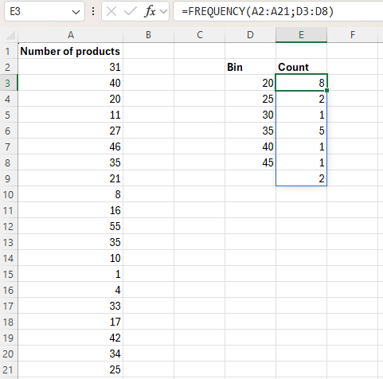

Hide the column D with the bin numbers (upper levels) and insert a column with proper bin labels.

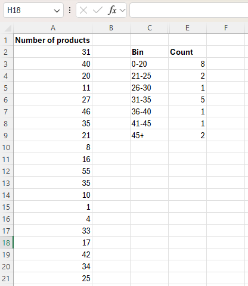

Descriptive Statistics

You can use the Analysis Toolpak add-in to generate descriptive statistics. 

1. On the Data tab, in the Analysis group, click Data Analysis.
2. Select Descriptive Statistics and click OK.
3. Select the Input Range.
4. Select the Output Range.
5. Make sure Summary statistics is checked.

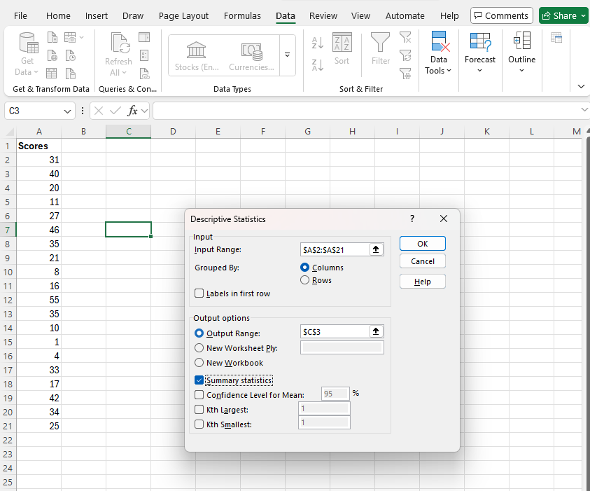

6. Click OK.
7. Result:

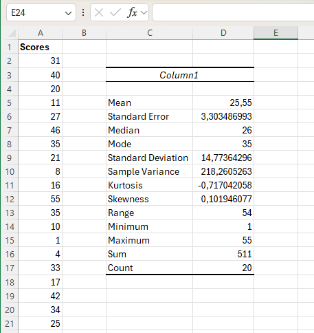

 
