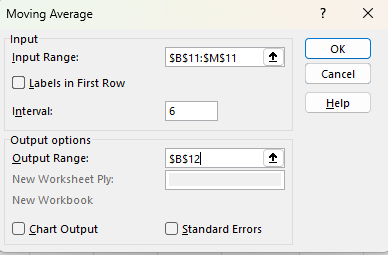

# 📈 Excel-11

---

## ✨ Project Description

**Excel-11** is a comprehensive guide to statistical functions in Microsoft Excel. Here you'll find practical tips, concise explanations, and illustrated examples for functions such as **AVERAGE, AVERAGEIF, MEDIAN, MODE, STDEV, MIN, MAX, LARGE, SMALL, Weighted Average, Moving Average, RAND, RANDARRAY, RANK, Percentiles, Quartiles, Box and Whisker Plot, FORECAST, FREQUENCY**, and more.

> 📚 **Goal:** Help you master Excel's statistical tools for data analysis, whether you're a student, analyst, or professional.

---

## 📒 Table of Contents

- [AVERAGE](#-average)
- [AVERAGEIF & AVERAGEIFS](#-averageif--averageifs)
- [MEDIAN](#-median)
- [MODE](#-mode)
- [Standard Deviation (STDEV, STDEV.P, STDEV.S)](#-standard-deviation-stdev-stdevp-stdevs)
- [Variance (VAR.P)](#-variance-varp)
- [MIN, MAX, LARGE, SMALL](#-min-max-large-small)
- [AVERAGEA](#-averagea)
- [Weighted Average](#-weighted-average)
- [Moving Average](#-moving-average)
- [Random Numbers (RAND, RANDBETWEEN, RANDARRAY)](#-random-numbers-rand-randbetween-randarray)
- [RANK, RANK.AVG, RANK.EQ](#-rank-rankavg-rankeq)
- [Percentiles and Quartiles](#-percentiles-and-quartiles)
- [Box and Whisker Plot](#-box-and-whisker-plot)
- [FORECAST & FORECAST.LINEAR](#-forecast--forecastlinear)
- [MAXIFS & MINIFS](#-maxifs--minifs)
- [FREQUENCY](#-frequency)
- [Descriptive Statistics](#-descriptive-statistics)
- [How to add Analysis ToolPak](#-how-to-add-analysis-toolpak)
- [Screenshots](#-screenshots)
- [Requirements](#-requirements)
- [Author](#-author)

---

## 🧮 AVERAGE

To calculate the average of a group of numbers, use the `AVERAGE` function.

---

## 🧾 AVERAGEIF & AVERAGEIFS

Use `AVERAGEIF` to average cells based on one criterion (e.g., excluding zeros).  
Use `AVERAGEIFS` to apply multiple criteria.

---

## 🎯 MEDIAN

Find the median (middle number) using the `MEDIAN` function.

> ℹ️ In case of an even number of values, the median is the mean of the two middle numbers.

---

## 🔁 MODE

Find the most frequently occurring number with the `MODE` function.

---

## 📏 Standard Deviation (STDEV, STDEV.P, STDEV.S)

- **STDEV**: Calculates standard deviation for a sample (old function).
- **STDEV.P**: For the entire population.
- **STDEV.S**: For a sample (recommended).

> ℹ️ Standard deviation indicates how much values differ from the average.

---

## 📐 Variance (VAR.P)

Variance is the square of the standard deviation.

---

## 🆒 MIN, MAX, LARGE, SMALL

Functions for finding minimum, maximum, largest, and smallest values in a dataset.  
*(See also examples below for usage with AVERAGE and LARGE.)*

---

## 🧮 AVERAGEA

`AVERAGEA` returns the arithmetic mean, treating text and logical values differently than `AVERAGE`:
- `FALSE` and text = 0
- `TRUE` = 1

---

## 🧩 Some Examples with AVERAGE

- Calculate the average of the top 3 numbers using `AVERAGE` and `LARGE`:

- Calculate the average of cells that meet criteria with `AVERAGEIF`:

---

## ⚖️ Weighted Average

Calculate a weighted average using `SUMPRODUCT` and `SUM`.

---

## 📊 Moving Average

Smooth trends in time series data with a moving average.  
Use the **Analysis ToolPak**:

1. Data tab → Analysis group → Data Analysis
2. Select "Moving Average"
3. Choose input range, interval, and output range

> 📈 The larger the interval, the smoother the trend line.

---

## 🎲 Random Numbers (RAND, RANDBETWEEN, RANDARRAY)

- **RAND**: Random decimal between 0 and 1

  

- **RANDBETWEEN**: Random integer between two values

  

- **RANDARRAY**: Random array (Excel 365/2021 only)

  

> ⚠️ Random numbers update on every recalculation.

---

## 🏅 RANK, RANK.AVG, RANK.EQ

- **RANK**: Returns rank in a list.
- **RANK.AVG**: Average rank if duplicates exist.
- **RANK.EQ**: Updated version; works as RANK.

### Cool Example (Top N Results, Filtering, Sorting)

- Use `RANK`, `LARGE`, `FILTER`, and `SORT` to display top results:

---

## 📊 Percentiles and Quartiles

- **PERCENTILE**: Find e.g. the 30th percentile.

  

- **QUARTILE**: Find the 1st quartile.

  

---

## 📦 Box and Whisker Plot

Shows min, 1st quartile, median, 3rd quartile, and max.

1. Select range (e.g., A1:A7)
2. Insert → Statistic Chart → Box and Whisker

- Median (middle line)
- Mean (x in box)
- Whiskers show min/max

---

## 📈 FORECAST & FORECAST.LINEAR

- **FORECAST**: Old function, now replaced by **FORECAST.LINEAR**
- Predicts a value along a linear trend.

> 💡 For seasonal data, use **FORECAST.ETS** (Excel 2016+).

---

## ⬆️⬇️ MAXIFS & MINIFS

Find maximum or minimum values based on criteria (Excel 2016+).

---

## 📉 FREQUENCY

Calculate how often values fall into bins.

---

## 📋 Descriptive Statistics

Use the **Analysis ToolPak** to generate summary statistics.

1. Data tab → Data Analysis
2. Select "Descriptive Statistics"
3. Input/output range, check "Summary statistics"

---

## 🛠️ How to add Analysis ToolPak

1. File → Options
2. Add-ins → Analysis ToolPak → Go
3. Check Analysis ToolPak → OK
4. Data tab → Analysis group → Data Analysis

---

## 📷 Screenshots

All images can be found in the `/Screenshots` folder.

---

## ℹ️ Requirements

- Microsoft Excel (recommended: 2021/365 for modern functions)
- Windows OS (for some add-ins)

---

## 👨‍💻 Author

Project and documentation by **Kuba27x**  
Repository: [Kuba27x/Excel-11](https://github.com/Kuba27x/Excel-11)

---
